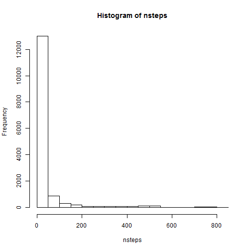
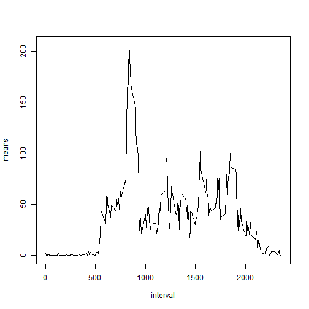
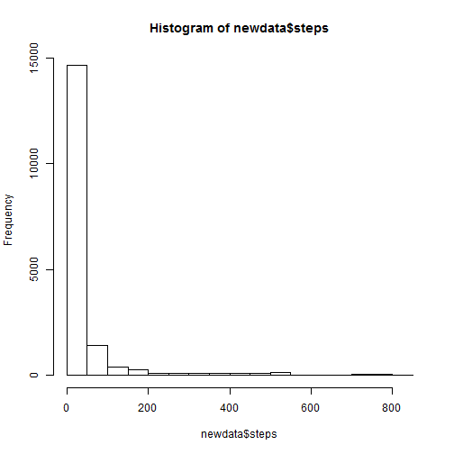
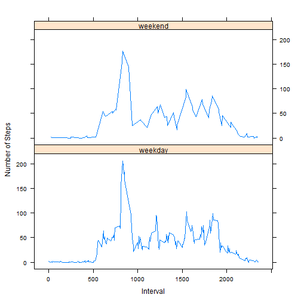

========================================================

From [Assignment 1 Instructions] (https://class.coursera.org/repdata-002/human_grading/view/courses/972084/assessments/3/submissions): "This assignment makes use of data from a personal activity monitoring device. This device collects data at 5 minute intervals through out the day. The data consists of two months of data from an anonymous individual collected during the months of October and November, 2012 and include the number of steps taken in 5 minute intervals each day."         


This document includes an overview of some simple analyses and plots with which to explore this data.


Loading and preprocessing the data
-------------------------------------------------------
First, the working directory path must be properly set in RStudio (?setwd). Then load the data provided in [Assignment 1 Instructions] (https://class.coursera.org/repdata-002/human_grading/view/courses/972084/assessments/3/submissions).


```r
data <- read.csv("activity.csv")
```


and take a quick peek at the contents and organization of the data.

```r
head(data)
```

```
##   steps       date interval
## 1    NA 2012-10-01        0
## 2    NA 2012-10-01        5
## 3    NA 2012-10-01       10
## 4    NA 2012-10-01       15
## 5    NA 2012-10-01       20
## 6    NA 2012-10-01       25
```


Basic description of the data
-------------------------------------------------------

The variable "step" shown above is the number of steps taken for each 5 minute "interval" on a given "date". Before analyzing, clean the "steps" data.

```r
nsteps <- na.omit(data[, "steps"])
```


The distribution

```r
hist(nsteps)
```

 

mean 

```r
mean(nsteps)
```

```
## [1] 37.38
```

and median 

```r
median(nsteps)
```

```
## [1] 0
```

of the number of steps taken provide an initial description of the data.


Mean number of steps per day
-------------------------------------------------------
Calculate the mean number of steps taken during each 5 minute interval throughout the day, omitting missing values, and create a vector that contains the interval data.

```r
x <- split(data, data$interval)
means <- unlist(lapply(x, function(x) y <- mean(x$steps, na.rm = TRUE)))
interval <- as.numeric(names(means))
```


and plot the means versus the intervals

```r
plot(interval, means, type = "l")
```

 


One can then determine the interval during which the greatest mean number of steps was taken.

```r
which.max(means)
```

```
## 835 
## 104
```


This output indicates that the 835th interval (104th element of the vector) had the greatest mean number of steps, which is consistent with the plot above.

Imputing missing values
-------------------------------------------------------
Above, missing values for a number of intervals were discarded. The number of discarded values is given by

```r
sum(!complete.cases(data$steps))
```

```
## [1] 2304
```


Instead of omitting these 2304 missing values, one can replace them with other values, such as the mean or median. Here, the missing values in each given interval have been replaced by the mean value for that interval, using the list x defined above.

```r
newdata <- do.call(rbind, lapply(x, function(x) {
    x[is.na(x$steps), "steps"] <- mean(x$steps, na.rm = TRUE)
    y <- x
}))
```


When one compares the distribution, mean, and median to that of the sanitized data

```r
hist(newdata$steps)
```

 

```r
mean(newdata$steps)
```

```
## [1] 37.38
```

```r
median(newdata$steps)
```

```
## [1] 0
```


one finds that though the number of measurements has been increased, the shape of the distribution seems similar, and the mean and median are the same. But further examination indicates that the shape of distribution has been changed.


```r
summary(nsteps)
```

```
##    Min. 1st Qu.  Median    Mean 3rd Qu.    Max. 
##     0.0     0.0     0.0    37.4    12.0   806.0
```

```r
summary(newdata$steps)
```

```
##    Min. 1st Qu.  Median    Mean 3rd Qu.    Max. 
##     0.0     0.0     0.0    37.4    27.0   806.0
```

```r
sd(nsteps)
```

```
## [1] 112
```

```r
sd(newdata$steps)
```

```
## [1] 105.3
```


Here, substituting missing values with the mean for each interval leaves the range intact, but results in an increase in the value delimiting the 3rd quartile in the imputed data with respect to that of the sanitized data, reduces the standard deviation, and tightens the a distribution.


Weekends versus Weekdays
----------------------------------------
One can also compare the number of steps taken on weekdays to the number taken on weekends by converting the "dates" into the days of the week and creating a factor with the levels 'weekday' and 'weekend'.

```r
newdata$days <- weekdays(as.POSIXct(newdata$date))
newdata$wknd <- newdata$days == "Sunday" | newdata$days == "Saturday"
newdata$wknd <- as.factor(newdata$wknd)
levels(newdata$wknd) = c("weekday", "weekend")
```


As before, the means of the number of steps taken by interval for the imputed data are calculated with 

```r
x <- split(newdata, newdata$interval)
newmeans <- unlist(lapply(x, function(x) y <- mean(x$steps, na.rm = TRUE)))
```


When the plots of the number of steps taken during 5 minute intervals on weekdays and weekends are compared


```r
library(lattice)
xyplot(newmeans ~ interval | newdata$wknd, type = "l", xlab = "Interval", ylab = "Number of Steps", 
    layout = c(1, 2))
```

 


it appears that the number of steps taken on weekdays and weekends are similar in shape, but the weekday distribution is much noisier.
etween weekdays and weekends?
