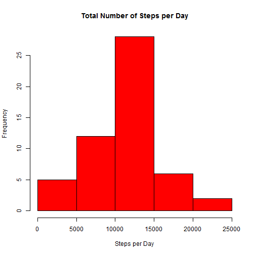
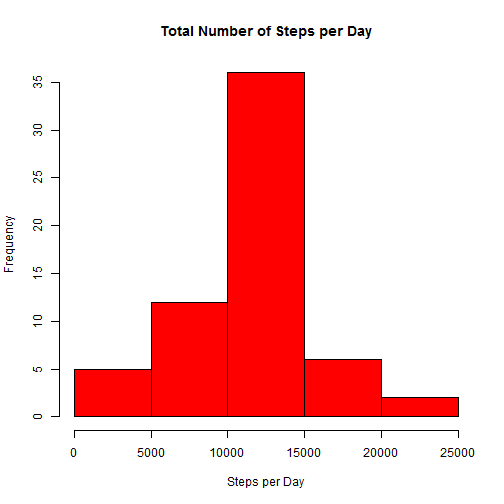

# Reproducible Research Assignment 1
========================================================

From [Assignment 1 Instructions] (https://class.coursera.org/repdata-002/human_grading/view/courses/972084/assessments/3/submissions)
> This assignment makes use of data from a personal activity monitoring device. 
> This device collects data at 5 minute intervals through out the day. 
> The data consists of two months of data from an anonymous individual collected 
> during the months of October and November, 2012 and include the number of steps taken in 5 minute intervals each day.         


### Loading and preprocessing the data
Set the working directory path appropriately ("/repdata-data-activity") and read the data.


```r
dat <- read.csv("activity.csv")
head(dat)
```

```
##   steps       date interval
## 1    NA 2012-10-01        0
## 2    NA 2012-10-01        5
## 3    NA 2012-10-01       10
## 4    NA 2012-10-01       15
## 5    NA 2012-10-01       20
## 6    NA 2012-10-01       25
```


Remove the missing values in the number of steps.

```r
clean.dat <- dat[!is.na(dat$steps), ]
head(clean.dat)
```

```
##     steps       date interval
## 289     0 2012-10-02        0
## 290     0 2012-10-02        5
## 291     0 2012-10-02       10
## 292     0 2012-10-02       15
## 293     0 2012-10-02       20
## 294     0 2012-10-02       25
```


###  Total and mean number of steps per day
Create a histogram of the total number of steps taken per day.

```r
x <- with(clean.dat, aggregate(steps ~ date, FUN = sum))
hist(x$steps, main = "Total Number of Steps per Day", xlab = "Steps per Day", 
    col = "red")
```

 


What are the mean and median number of total steps taken per day?

```r
mean(x$steps)
```

```
## [1] 10766
```

```r
median(x$steps)
```

```
## [1] 10765
```


### Average daily activity pattern
Make a time series plot of the average number of steps taken versus the 5-minute intervals, averaged across all days.

```r
y <- with(clean.dat, aggregate(steps ~ interval, FUN = mean))
plot(y$interval, y$steps, type = "l", xlab = "Interval", ylab = "Average Number of Steps")
```

 


In what interval was the maximum number of steps taken? 

The maximum _mean_ number of steps taken was in this interval.

```r
y[which.max(y$steps), ]
```

```
##     interval steps
## 104      835 206.2
```


The maximimum _total_ number of steps taken was in the same interval, as the intervals were of the same length.


```r
z <- with(clean.dat, aggregate(steps ~ interval, FUN = sum))
z[which.max(z$steps), ]
```

```
##     interval steps
## 104      835 10927
```


### Imputing missing values
Calculate and report the total number of missing values in the dataset

```r
sum(is.na(dat$steps))
```

```
## [1] 2304
```


Devise a strategy for filling in all of the missing values in the dataset. 
Create a new dataset that is equal to the original dataset but with the missing data filled in. Here, I used the mean of each 5 minute interval. For some reason my function messed up the row numbers, so I renumbered them. Note that the date ordering is now 
different.

```r
z <- split(dat, dat$interval)

new.dat <- do.call(rbind, lapply(z, function(x) {
    x[is.na(x), "steps"] <- mean(x$steps, na.rm = TRUE)
    x
}))

rownames(new.dat) <- c(1:dim(new.dat)[1])
sum(is.na(new.dat$steps))
```

```
## [1] 0
```

```r
head(new.dat)
```

```
##    steps       date interval
## 1  1.717 2012-10-01        0
## 2  0.000 2012-10-02        0
## 3  0.000 2012-10-03        0
## 4 47.000 2012-10-04        0
## 5  0.000 2012-10-05        0
## 6  0.000 2012-10-06        0
```


Histogram, mean and median of imputed data

```r
x <- with(new.dat, aggregate(steps ~ date, FUN = sum))
hist(x$steps, main = "Total Number of Steps per Day", xlab = "Steps per Day", 
    col = "red")
```

 

```r
mean(x$steps)
```

```
## [1] 10766
```

```r
median(x$steps)
```

```
## [1] 10766
```


The distribution tightened with the addition of 2304 repetitions of the mean. The median has changed since new values have been added, but the mean didn't change because the additional values were the interval means.

### Weekends versus Weekdays
Create a new factor variable in the dataset with two levels - "weekday" and "weekend" indicating whether a given date is a weekday or weekend day.

```r
new.dat$days <- weekdays(as.POSIXct(new.dat$date))
new.dat$wknd <- new.dat$days == "Sunday" | new.dat$days == "Saturday"
new.dat$wknd <- as.factor(new.dat$wknd)
levels(new.dat$wknd) = c("weekday", "weekend")
head(new.dat, 7)
```

```
##    steps       date interval      days    wknd
## 1  1.717 2012-10-01        0    Monday weekday
## 2  0.000 2012-10-02        0   Tuesday weekday
## 3  0.000 2012-10-03        0 Wednesday weekday
## 4 47.000 2012-10-04        0  Thursday weekday
## 5  0.000 2012-10-05        0    Friday weekday
## 6  0.000 2012-10-06        0  Saturday weekend
## 7  0.000 2012-10-07        0    Sunday weekend
```


Calculate the means for each interval across weekdays and weekend days separately.

```r
y <- with(new.dat, aggregate(steps, list(interval, wknd), FUN = mean))
colnames(y) <- c("int", "wknd", "steps")
str(y)
```

```
## 'data.frame':	576 obs. of  3 variables:
##  $ int  : int  0 5 10 15 20 25 30 35 40 45 ...
##  $ wknd : Factor w/ 2 levels "weekday","weekend": 1 1 1 1 1 1 1 1 1 1 ...
##  $ steps: num  2.251 0.445 0.173 0.198 0.099 ...
```


Plot the mean number of steps for each interval for weekends and weekdays.

```r
library(lattice)
xyplot(y$steps ~ y$int | y$wknd, type = "l", xlab = "Interval", ylab = "Number of Steps", 
    layout = c(1, 2))
```

 


These plots show different patterns of activity - more consistent activity across time on the weekend, and more activity early in the day on weekdays, presumably regular morning exercise or dashing about while late to work :)
